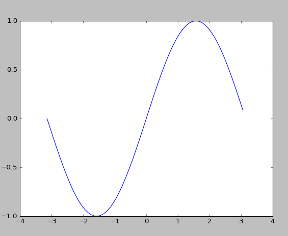

# Python画图工具matplotlib简单使用

## [官网][1]介绍：
Matplotlib is a Python 2D plotting library which produces publication quality figures in a variety of hardcopy formats and interactive environments across platforms.

## 简单使用

> anaconda自带matplotlib模块。

### 制图初步

1. 将函数转化成关于X, Y, Z坐标点的数组；
2. 利用np.arange进行采样；
3. 利用采样点，np.函数计算对应的函数值；
4. 数据全部以np.array表达。

### 数据的快速产生

- arange函数进行采样
- linspace函数指定开始值、终值和元素个数来成创建一维数组。
可以通过endpoint=True关键字指定是否包括终值。

```
>>> import numpy as np
>>> np.arange(0, 10, 1)
array([0, 1, 2, 3, 4, 5, 6, 7, 8, 9])

In [3]: np.linspace(1,10,10)
Out[3]: array([  1.,   2.,   3.,   4.,   5.,   6.,   7.,   8.,   9.,  10.])

In [4]: np.linspace(1,10,10, endpoint=False)
Out[4]: array([ 1. ,  1.9,  2.8,  3.7,  4.6,  5.5,  6.4,  7.3,  8.2,  9.1])

```

- numpy提供了大量函数，计算速度快
```
import numpy as np
import matplotlib.pyplot as plt
x = np.arange(-np.pi, np.pi, 0.1)
y = np.sin(x)
plt.plot(x, y, 'b')
plt.show()

```


| 缩写 |  颜色  |
| ---- | ------ |
| ‘b’  | blue   |
| 'g'  | green  |
| 'r'  | red    |
| 'c'  | cyan   |
| 'y'  | yellow |
| 'k'  | black  |
| 'w'  | white  |

### 未完待续。。。


[1]: https://matplotlib.org/
