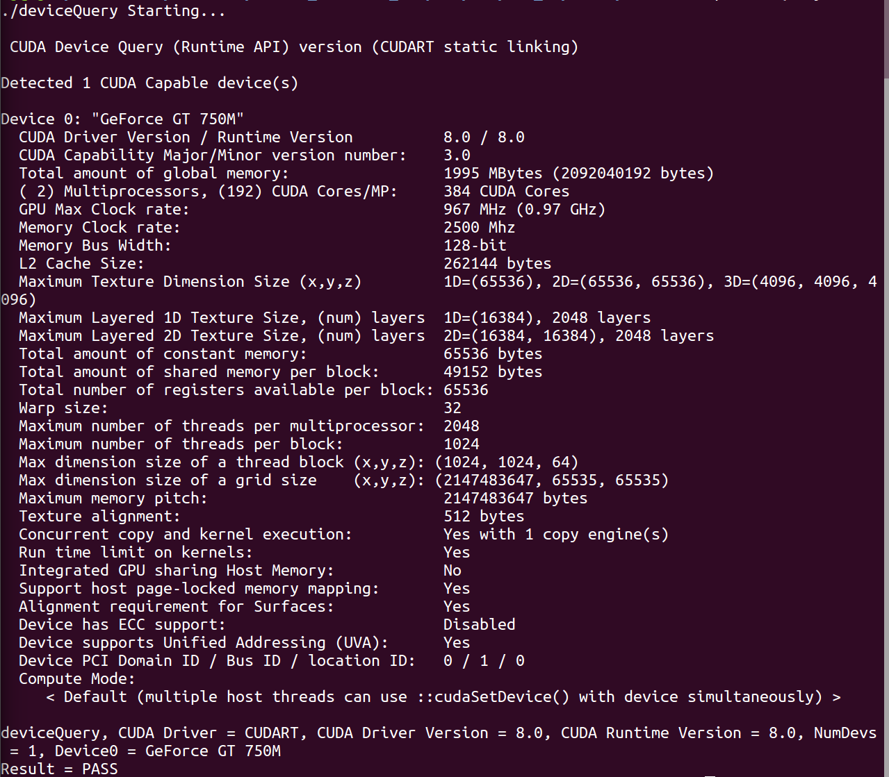

## 一 [官网](http://www.nvidia.com/Download/index.aspx?lang=cn)下载对应的显卡驱动并安装(需要屏蔽掉开源显卡驱动)

## 二 安装cuda

１. [下载cuda](https://developer.nvidia.com/cuda-toolkit-archive),选择对应的版本,多次试坑之后我选择的是.run(local)版本的，下载完之后安装.

<!-- 以下为.deb版本的安装方式,有显卡驱动问题的建议用.run版本的,

	1. sudo dpkg -i cuda-repo-ubuntu1604-8-0-local-ga2_8.0.61-1_amd64.deb
	2. sudo apt-get update
	3. sudo apt-get install cuda
	4. vim ~/.bashrc
	5. 最后一行写上：export PATH=/usr/local/cuda-8.0/bin${PATH:+:${PATH}} -->
	1. 运行.run安装包 `sudo ./cuda_8.0.61_375.26_linux.run`
	2. Ctrl + C 跳过一些介绍,然后根据情况选择.(第二项安装驱动一定要选择no,因为第一步我们已经安装过显卡驱动了,不要重复安装,很危险!)我选择的是:
		1. Do you accept the previously read EULA? accept
		2. Install NVIDIA Accelerated Graphics Driver for Linux-x86_64 375.26? n
		3. Install the CUDA 8.0 Toolkit? y
		4. Enter Toolkit Location: Enter键
		5. Do you want to install a symbolic link at /usr/local/cuda? y
		6. Do you want to install a symbolic link at /usr/local/cuda? y
		7. Done!
	3. ~/.bashrc中添加
		1. export LD_LIBRARY_PATH=/usr/local/cuda/lib64/
		2. export PATH=/usr/local/cuda-8.0/bin${PATH:+:${PATH}}

２. 验证 nvcc -V　显示编译器信息，则说明cuda配置成功了

３. cuda性能测试

	1. 安装可写样本：cuda-install-samples-8.0.sh <dir>
	2. cd NVIDIA_CUDA-8.0_Samples
	3. make
	4. cd NVIDIA_CUDA-8.0_Samples/bin/x86_64/linux/release
	5. ./deviceQuery
	6. 输出如图：结果显示pass则说明cuda安装配置完成。

４. 安装cudnn库(深度神经网络加速计算库)(tensorflow1.4貌似需要安装cudnn6.0了!!)

	1. 下载cudnn ~~v5.1~~v6.0
	2. 解压，然后把解压后的文件夹cuda下的include和lib64文件夹下的文件复制到/usr/local/cuda/下对应的include和lib64文件夹里。

		1. sudo cp include/cudnn.h /usr/local/cuda/include/
		2. sudo cp lib64/* /usr/local/cuda/lib64/

	3. cd /usr/local/cuda/lib64
	4. ~~sudo ln -sf libcudnn.so.5.1.10 libcudnn.so.5~~sudo ln -sf libcudnn.so.6.0.21 libcudnn.so.6
	5. ~~sudo ln -sf libcudnn.so.5 libcudnn.so~~sudo ln -sf libcudnn.so.6 libcudnn.so
	6. sudo ldconfig -v

6. 至此,安装全部完成,下面为遇到的问题:
	1. 运行程序时如报错:libcudart.so.8.0: cannot open shared object file: No such file or directory

		以下方法都可以试一下:
		- [官方常见错误](https://www.tensorflow.org/install/install_sources#common_installation_problems)
		- sudo ldconfig /usr/local/cuda/lib64(亲试可行)  

## 二　运算加速库(可选)

	sudo apt install -y libopenblas-dev liblapack-dev libatlas-base-dev
	sudo apt-get install libcupti-dev

## 三　安装anaconda
网上教程很多，一笔带过了。

## 四　安装gpu版[tensorflow][]

### 安装(官网选择最新版本的链接！)：

	1. conda create -n tensorflow
	2. source activate tensorflow
	3. pip install --ignore-installed --upgrade https://storage.googleapis.com/tensorflow/linux/gpu/tensorflow_gpu-1.4.0-cp35-cp35m-linux_x86_64.whl

### 验证

	1. 新建文件test.py，内容如下

		import tensorflow as tf
		hello = tf.constant('Hello, TensorFlow!')
		sess = tf.Session()
		print(sess.run(hello))

	2. 输出：
		b'Hello, Tensorflow!'

## 五　安装keras

### 安装：

	1. pip install keras

### 验证：

	1. 终端输入：
		python -c "import keras"
	2. 输出：
		Using TensorFlow backend.

[tensorflow]: https://www.tensorflow.org/install/install_linux#InstallingAnaconda

## 参考
1. [ubuntu16.04安装cuda8.0+cuDNN6.0+tensorflow1.4配置过程](http://blog.csdn.net/liushui94/article/details/78510115)

